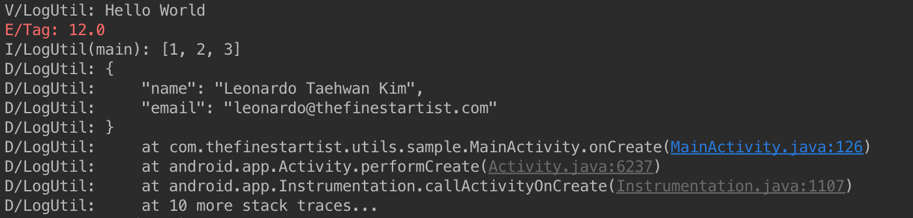

# AndroidBaseUtils
[](http://developer.android.com/index.html)
[](https://android-arsenal.com/api?level=7)
[](http://opensource.org/licenses/MIT)


#### Context free and basic utils to build Android project conveniently

Any kinds of contributions including **pull requests**, **registering new issues**, **sending me personal emails** are always welcome. Let me know if you have any idea about basic utils for Android development.


# Table of Contents
1. [Get started](#get-started)
1. [Utils](#utils)
    1. [Base](#base)
    1. [LogUtil (L)](#logutil-l)
    1. [LogHelper](#loghelper)
    1. [ContextUtil (Ctx)](#contextutil-ctx)
    1. [ResourcesUtil (Res)](#resourcesutil-res)
    1. [PreferencesUtil (Pref)](#preferencesutil-pref)
    1. [ExtrasBinder](#extrasbinder)
    1. [UnitConverter (Unit)](#unitconverter-unit)
    1. [KeyboardUtil (Keyboard)](#keyboardutil-keyboard)
    1. [APILevel](#apilevel)
    1. [DisplayUtil](#displayutil)
    1. [ViewUtil](#viewutil)
    1. [ServiceUtil](#serviceutil)
    1. [ThemeUtil](#themeutil)
    1. [ActivityBuilder](#activitybuilder)
    1. [BundleBuilder](#bundlebuilder)
    1. [PackageUtil](#packageutil)
    1. [VibratorUtil](#vibratorutil)
    1. [ClipboardManagerUtil](#clipboardmanagerutil)
    1. [TypedValueUtil](#typedvalueutil)
    1. [WindowManagerUtil](#windowmanagerutil)
    1. [IntArrayUtil](#intarrayutil)
    1. [SparseArrayUtil](#sparsearrayutil)
    1. [ThreadUtil](#threadutil)
1. [Contributors](#contributors)
1. [License](#license)

# Get started

#### Gradle Dependency (jcenter)
Release is in process...
```java
buildscript {
    dependencies {
        classpath 'com.neenbedankt.gradle.plugins:android-apt:1.8'
    }
}

apply plugin: 'com.neenbedankt.android-apt'

dependencies {
    compile 'com.thefinestartist:utils:0.9.4'
    apt 'com.thefinestartist:compilers:0.9.4'
}
```

#### Initialization (Application)
Call `Base.initialize(context)` within your `Application` `onCreate()` method.
```java
public class App extends Application {
    @Override
    public void onCreate() {
        super.onCreate();
        Base.initialize(this);
    }
}
```

# Utils

## Base
`Base` helps to get `Context`, `Resources`, `Assets`, `Configuration` and `DisplayMetrics` in any class.

```java
void            Base.initialize(Context context);

Context         Base.getContext();
Resources       Base.getResources();
Theme           Base.getTheme();
AssetManager    Base.getAssets();
Configuration   Base.getConfiguration();
DisplayMetrics  Base.getDisplayMetrics();
```

## LogUtil (L)
`LogUtil` helps to deal with `Log` conveniently.  
`L` is abbreviation class of `LogUtil`. You can `extends LogUtil` to create your own `L`.  

```java
Settings    L.getDefaultSettings();

LogHelper   L.tag(String tag);
LogHelper   L.tag(@StringRes int tagRes);
LogHelper   L.tag(Class clazz);
LogHelper   L.showThreadInfo(boolean showThreadInfo);
LogHelper   L.stackTraceCount(int stackTraceCount);
LogHelper   L.logLevel(LogLevel logLevel);
LogHelper   L.showDivider(boolean showDivider);
LogHelper   L.logPrinter(LogPrinter logPrinter);

void        L.v(byte message);
void        L.v(char message);
void        L.v(short message);
void        L.v(int message);
void        L.v(long message);
void        L.v(float message);
void        L.v(double message);
void        L.v(boolean message);
void        L.v(String message);
void        L.v(JSONObject message);
void        L.v(JSONArray message);
void        L.v(Exception message);
void        L.v(Object message);
// and so on...

void        L.json(String jsonString);
void        L.json(LogLevel logLevel, String jsonString);
void        L.xml(String xmlString);
void        L.xml(LogLevel logLevel, String jsonString);
```

```java
// Set default settings at your Application.
L.getDefaultSettings()
        .setTag(LogUtil.class)
        .setShowThreadInfo(false)
        .setStackTraceCount(0)
        .setLogLevel(LogLevel.FULL)
        .setShowDivider(false)
        .setLogPrinter(new AndroidLogPrinter());
        
L.v("Hello World");
L.tag("Tag").e(12.0f);
L.showThreadInfo(true).i(new int[]{1, 2, 3});
L.stackTraceCount(3).showDivider(true).json("{\"name\":\"Leonardo Taehwan Kim\",\"email\":\"leonardo@thefinestartist.com\"}");
```


## LogHelper
`LogHelper` helps to deal with `Log` conveniently.

```java
LogHelper   new LogHelper();
LogHelper   new LogHelper(String tag);
LogHelper   new LogHelper(@StringRes int tagRes);
LogHelper   new LogHelper(Class clazz);

LogHelper   tag(String tag);
LogHelper   tag(@StringRes int tagRes);
LogHelper   tag(Class clazz);
LogHelper   showThreadInfo(boolean showThreadInfo);
LogHelper   stackTraceCount(int stackTraceCount);
LogHelper   logLevel(LogLevel logLevel);
LogHelper   showDivider(boolean showDivider);
LogHelper   logPrinter(LogPrinter logPrinter);

void        v(byte message);
void        v(char message);
void        v(short message);
void        v(int message);
void        v(long message);
void        v(float message);
void        v(double message);
void        v(boolean message);
void        v(String message);
void        v(JSONObject message);
void        v(JSONArray message);
void        v(Exception message);
void        v(Object message);
// and so on...

void        json(String jsonString);
void        json(LogLevel logLevel, String jsonString);
void        xml(String xmlString);
void        xml(LogLevel logLevel, String jsonString);
```

```java
// Set default settings at any Class.
LogHelper logHelper = new LogHelper(MainActivity.class).showThreadInfo(true);

logHelper.v("Hello World");
logHelper.e(12.0f);
logHelper.json("{\"name\":\"Leonardo Taehwan Kim\",\"email\":\"leonardo@thefinestartist.com\"}");
```


## ContextUtil (Ctx)
`ContextUtil` helps to use `Context` conveniently.  
`Ctx` is abbreviation class of `ContextUtil`. You can `extends ContextUtil` to create your own `Ctx`.  

```java
boolean         Ctx.bindService(Intent service, ServiceConnection conn, int flags);
int             Ctx.checkCallingOrSelfPermission(String permission);
int             Ctx.checkSelfPermission(@NonNull String permission);
void            Ctx.enforceCallingOrSelfPermission(String permission, String message);
void            Ctx.enforceCallingOrSelfUriPermission(Uri uri, int modeFlags, String message);
ApplicationInfo Ctx.getApplicationInfo();
File            Ctx.getCacheDir();
File            Ctx.getExternalCacheDir();
File            Ctx.getExternalFilesDir(String type);
Looper          Ctx.getMainLooper();
Object          Ctx.getSystemService(String name);
void            Ctx.sendBroadcast(Intent intent, String receiverPermission);
void            Ctx.sendBroadcast(Intent intent);
boolean         Ctx.startActivities(Intent[] intents, Bundle options);
boolean         Ctx.startActivities(Intent[] intents);
void            Ctx.startActivity(@NonNull Intent intent);
void            Ctx.startActivity(Intent intent, Bundle options);
ComponentName   Ctx.startService(Intent service);
boolean         Ctx.stopService(Intent service);
void            Ctx.unbindService(ServiceConnection conn);
// and so on...
```

## ResourcesUtil (Res)
`ResourcesUtil` helps to use `Resources` conveniently.  
`Res` is abbreviation class of `ResourcesUtil`. You can `extends ResourcesUtil` to create your own `Res`.  

```java
XmlResourceParser   Res.getAnimation(@AnimRes int animRes);
boolean             Res.getBoolean(@BoolRes int boolRes);
int                 Res.getColor(@ColorRes int colorRes);
int                 Res.getColor(@ColorRes int colorRes, Resources.Theme theme);
ColorStateList      Res.getColorStateList(@ColorRes int colorRes);
ColorStateList      Res.getColorStateList(@ColorRes int colorRes, Resources.Theme theme);
float               Res.getDimension(@DimenRes int dimenRes);
int                 Res.getDimensionPixelOffset(@DimenRes int dimenRes);
int                 Res.getDimensionPixelSize(@DimenRes int dimenRes);
DisplayMetrics      Res.getDisplayMetrics();
Drawable            Res.getDrawable(@DrawableRes int drawableRes);
int                 Res.getIdentifier(String name, String defType, String defPackage);
int[]               Res.getIntArray(@ArrayRes int arrayRes);
int                 Res.getInteger(@IntegerRes int integerRes);
XmlResourceParser   Res.getLayout(@LayoutRes int layoutRes);
String              Res.getQuantityString(int id, int quantity, Object... formatArgs);
CharSequence        Res.getQuantityText(int id, int quantity);
String              Res.getResourceEntryName(@AnyRes int anyRes);
String              Res.getResourceName(@AnyRes int anyRes);
String              Res.getResourcePackageName(@AnyRes int anyRes);
String              Res.getResourceTypeName(@AnyRes int anyRes);
String              Res.getString(@StringRes int stringRes);
String              Res.getString(@StringRes int stringRes, Object... formatArgs);
String[]            Res.getStringArray(@ArrayRes int arrayRes);
CharSequence        Res.getText(@StringRes int stringRes, CharSequence def);
CharSequence        Res.getText(@StringRes int stringRes);
CharSequence[]      Res.getTextArray(@ArrayRes int arrayRes);
void                Res.getValue(String name, TypedValue outValue, boolean resolveRefs);
void                Res.getValue(@AnyRes int anyRes, TypedValue outValue, boolean resolveRefs);
void                Res.getValueForDensity(@AnyRes int anyRes, int density, TypedValue outValue, boolean resolveRefs);
XmlResourceParser   Res.getXml(@XmlRes int xmlRes);
TypedArray          Res.obtainAttributes(AttributeSet set, int[] attrs);
TypedArray          Res.obtainTypedArray(@ArrayRes int anyRes);
InputStream         Res.openRawResource(@RawRes int rawRes);
AssetFileDescriptor Res.openRawResourceFd(@RawRes int rawRes);
int[]               Res.getColorArray(@ArrayRes int array);
// and so on...
```

## PreferencesUtil (Pref)
`PreferencesUtil` helps to manage application-wide preferences conveniently.  
`Pref` is abbreviation class of `PreferencesUtil`. You can `extends PreferencesUtil` to create your own `Pref`.  

```java
String         Pref.getDefaultName();
void           Pref.setDefaultName(String name);

boolean        Pref.get(String key, boolean defValue);
int            Pref.get(String key, int defValue);
float          Pref.get(String key, float defValue);
long           Pref.get(String key, long defValue);
String         Pref.get(String key, String defValue);
Set<String>    Pref.get(String key, Set<String> defValue);
C              Pref.get(String key, C defValue);

boolean        Pref.get(String name, String key, boolean defValue);
int            Pref.get(String name, String key, int defValue);
float          Pref.get(String name, String key, float defValue);
long           Pref.get(String name, String key, long defValue);
String         Pref.get(String name, String key, String defValue);
Set<String>    Pref.get(String name, String key, Set<String> defValue);
C              Pref.get(String name, String key, C defValue);

void           Pref.put(String key, boolean value);
void           Pref.put(String key, int value);
void           Pref.put(String key, float value);
void           Pref.put(String key, long value);
void           Pref.put(String key, String value);
void           Pref.put(String key, Set<String> value);
void           Pref.put(String key, C value);

void           Pref.put(String name, String key, boolean value);
void           Pref.put(String name, String key, int value);
void           Pref.put(String name, String key, float value);
void           Pref.put(String name, String key, long value);
void           Pref.put(String name, String key, String value);
void           Pref.put(String name, String key, Set<String> value);
void           Pref.put(String name, String key, C value);

void           Pref.remove(String key);
void           Pref.remove(String name, String key);

void           Pref.clear();
void           Pref.clear(String name);
```

## ExtrasBinder
Simply call `ExtrasBinder.bind(this)` in your `Activity` or `Fragment`. ExtrasBinder binds data from `Intent` or `Bundle` to matching variable. ExtrasBinder will consider `annotation variable` as key. If there is no annotation variable, it will consider `variable name` as key.

```java
// Start YourActivity with extras
Intent intent = new Intent(this, YourActivity.class);
intent.putExtra(YourActivity.EXTRA_TITLE, "Activity title");
intent.putExtra("ids", new ArrayList<Integer>());
startActivity(intent);
```
```java
public class YourActivity extends AppCompatActivity {

    public static final String EXTRA_TITLE = "TITLE";

    @Extra(EXTRA_TITLE) String title;
    @Extra ArrayList<Integer> ids;

    @Override
    protected void onCreate(Bundle savedInstanceState) {
        super.onCreate(savedInstanceState);
        ExtrasBinder.bind(this);
        // do something...
    }
}
```
```java
// Show YourFragment with extras
YourFragment fragment = new YourFragment();
Bundle bundle = new Bundle();
bundle.putString("Name", "Fragment name");
fragment.setArguments(bundle);
```
```java
public class YourFragment extends Fragment {

    @Extra("NAME") String name;
    
    @Nullable 
    @Override 
    public View onCreateView(LayoutInflater inflater, ViewGroup container, Bundle savedInstanceState) {
        ExtrasBinder.bind(this);
        // do something...
    }
}
```

Proguard
```java
-keep class com.thefinestartist.annotations.** { *; }
-keep class **$$ExtraBinder { *; }
-keepclasseswithmembernames class * {
    @com.thefinestartist.annotations.Extra <fields>;
}
```

## UnitConverter (Unit)
`UnitConverter` helps to convert dp or sp size into pixel.  
`Unit` is abbreviation class of `UnitConverter`. You can `extends UnitConverter` to create your own `Unit`.  

```java
float   Unit.dpToPx(float dp);
int     Unit.dpToPx(int dp);
float   Unit.pxToDp(float px);
int     Unit.pxToDp(int px);
float   Unit.spToPx(float sp);
int     Unit.spToPx(int sp);
float   Unit.pxToSp(float px);
int     Unit.pxToSp(int px);
```

## KeyboardUtil (Keyboard)
`KeyboardUtil` helps to `show` and `hide` keyboard conveniently.  
`Keyboard` is abbreviation class of `KeyboardUtil`. You can `extends KeyboardUtil` to create your own `Keyboard`.  

```java
void    Keyboard.show(View);
void    Keyboard.showImmediately(View); // Call this method if your activity or fragment is resumed.

void    Keyboard.hide(View);
void    Keyboard.hide(Activity);
void    Keyboard.hide(Fragment);
void    Keyboard.hide(Dialog);
```

## APILevel
`APILevel` helps to check device API `Build.VERSION` conveniently.

* Update your Android Studio lint option before you use this class. <a href="https://raw.githubusercontent.com/TheFinestArtist/AndroidBaseUtils/master/art/APILevel%20Lint%20Option.png" target="_blank">Show Image</a>  
```java
→ Android Studio  
→ Preferences...  
→ Editor  
→ Inspections  
→ Android Lint  
→ Calling new methods on older versions
→ Set Severity as Warning.
```

```java
boolean APILevel.require(int level); // Build.VERSION.SDK_INT >= level
boolean APILevel.requireCupcake();
boolean APILevel.requireDonut();
boolean APILevel.requireEclair();
boolean APILevel.requireFroyo();
boolean APILevel.requireGingerbread();
// and so on...

boolean APILevel.deprecatedAt(int level); // Build.VERSION.SDK_INT < level
boolean APILevel.deprecatedAtCupcake();
boolean APILevel.deprecatedAtDonut();
boolean APILevel.deprecatedAtEclair();
boolean APILevel.deprecatedAtFroyo();
boolean APILevel.deprecatedAtGingerbread();
// and so on...
```

## DisplayUtil
`DisplayUtil` helps to calculate screen size conveniently.

```java
int         DisplayUtil.getWidth();
int         DisplayUtil.getHeight();
Rotation    DisplayUtil.getRotation();
boolean     DisplayUtil.isDisplayPortrait();
boolean     DisplayUtil.isDisplayLandscape();
int         DisplayUtil.getStatusBarHeight();
int         DisplayUtil.getToolbarHeight();
int         DisplayUtil.getActionBarHeight();
int         DisplayUtil.getNavigationBarHeight(); // Navigation bar is located bottom of device for `back`, `home` and `menu` buttons.
```

## ViewUtil
`ViewUtil` helps to set background drawable conveniently.

```java
void    ViewUtil.setBackground(View view, Drawable drawable);
void    ViewUtil.setBackground(View view, int drawableRes);
```

## ServiceUtil
`ServiceUtil` helps to get Android system service conveniently.

```java
Object                  ServiceUtil.getSystemService(Context.ServiceName);

AccessibilityManager    ServiceUtil.getAccessibilityManager();
CaptioningManager       ServiceUtil.getCaptioningManager();
AccountManager          ServiceUtil.getAccountManager();
ActivityManager         ServiceUtil.getActivityManager();
AlarmManager            ServiceUtil.getAlarmManager();
AudioManager            ServiceUtil.getAudioManager();
MediaRouter             ServiceUtil.getMediaRouter();
// and so on...
```

## ThemeUtil
`ThemeUtil` helps to use `Theme` conveniently.

```java
void        ThemeUtil.applyStyle(int resId, boolean force);
void        ThemeUtil.dump(int priority, String tag, String prefix);
int         ThemeUtil.getChangingConfigurations();
Drawable    ThemeUtil.getDrawable(@DrawableRes int drawableRes);
Resources   ThemeUtil.getResources();
TypedArray  ThemeUtil.obtainStyledAttributes(@StyleableRes int[] attrs);
TypedArray  ThemeUtil.obtainStyledAttributes(@StyleRes int resid, @StyleableRes int[] attrs);
TypedArray  ThemeUtil.obtainStyledAttributes(AttributeSet set, @StyleableRes int[] attrs, @AttrRes int defStyleAttr, @StyleRes int defStyleRes);
boolean     ThemeUtil.resolveAttribute(int resid, TypedValue outValue, boolean resolveRefs);
void        ThemeUtil.setTo(Resources.Theme other);
```

## ActivityBuilder
`ActivityBuilder` helps to build `Activity Intent` and start `Activity`.

```java
Constructor         ActivityBuilder(@NonNull Class<C> clazz);

ActivityBuilder     ActivityBuilder.set(@NonNull String key, T value);
ActivityBuilder     ActivityBuilder.set(@NonNull String key, Parcelable value);
ActivityBuilder     ActivityBuilder.set(@NonNull String key, Parcelable[] value);
ActivityBuilder     ActivityBuilder.set(@NonNull String key, ArrayList<T> value);
ActivityBuilder     ActivityBuilder.remove(@NonNull String key);
ActivityBuilder     ActivityBuilder.setFlags(int flags);
ActivityBuilder     ActivityBuilder.addFlags(int flags);

Intent              ActivityBuilder.buildIntent();
void                ActivityBuilder.start();
void                ActivityBuilder.startForResult(@NonNull Activity activity, int requestCode);
void                ActivityBuilder.startForResult(@NonNull Activity activity, int requestCode, @Nullable Bundle options);
```

```java
new ActivityBuilder(YourActivity.class)
    .set(YourActivity.TITLE, "Title")
    .set(YourActivity.CONTENT, 1)
    .set("values", new int[]{1, 2, 3})
    .set(YourActivity.ARRAY_LIST, list)
    .start();
```

## BundleBuilder
`BundleBuilder` helps to build `Bundle` conveniently.

```java
BundleBuilder   BundleBuilder.set(String key, T value);
T               BundleBuilder.get(String key);
Bundle          BundleBuilder.build();
```

```java
Bundle bundle = new BundleBuilder()
                    .set("values", new int[]{1, 2, 3})
                    .build();
```

## PackageUtil
`PackageUtil` helps to handle methods related to package.

```java
boolean     PackageUtil.isInstalled(String packageName);
String      PackageUtil.getPackageName();
void        PackageUtil.openPlayStore();
void        PackageUtil.openPlayStore(String packageName);
```

## VibratorUtil
`VibratorUtil` helps to use `Vibrator` conveniently.

```java
void    VibratorUtil.vibrate(); // vibrate device for 200 milliseconds
void    VibratorUtil.vibrate(milliseconds);
// and more...
```

## ClipboardManagerUtil
`ClipboardManagerUtil` helps to use `ClipboardManager` conveniently.

```java
void            ClipboardManagerUtil.setText(CharSequence text);
boolean         ClipboardManagerUtil.hasText();
CharSequence    ClipboardManagerUtil.getText();
```

## TypedValueUtil
`TypedValueUtil` helps to use `TypedValue` class conveniently.

```java
float   TypedValueUtil.applyDimension(int unit, float value);
float   TypedValueUtil.complexToDimension(int data);
int     TypedValueUtil.complexToDimensionPixelOffset(int data);
int     TypedValueUtil.complexToDimensionPixelSize(int data);
```

## WindowManagerUtil
`WindowManagerUtil` helps to use `WindowManager` conveniently.

```java
Display     WindowManagerUtil.getDefaultDisplay();
void        WindowManagerUtil.removeViewImmediate(View view);
```

## IntArrayUtil
`IntArrayUtil` helps to deal with `IntArray` conveniently.

```java
boolean     IntArrayUtil.contains(int[] array, int value);
int[]       IntArrayUtil.add(int[] array, int value);
```

## SparseArrayUtil
`SparseArrayUtil` helps to deal with `SparseArray` conveniently.

```java
ArrayList<C>    SparseArrayUtil.asArrayList(SparseArray<C> sparseArray);
```

## ThreadUtil
`ThreadUtil` helps to deal with thread conveniently.

```java
boolean     ThreadUtil.isMain();
```

# Contributors
[Leonardo Taehwan Kim](https://github.com/thefinestartist)  
[Min Kim](https://github.com/openyourboxes)  
[Robin Gustafsson](https://github.com/rgson)  
[Marcos Trujillo](https://github.com/Aracem)  

# License

```
The MIT License (MIT)

Copyright (c) 2016 The Finest Artist

Permission is hereby granted, free of charge, to any person obtaining a copy
of this software and associated documentation files (the "Software"), to deal
in the Software without restriction, including without limitation the rights
to use, copy, modify, merge, publish, distribute, sublicense, and/or sell
copies of the Software, and to permit persons to whom the Software is
furnished to do so, subject to the following conditions:

The above copyright notice and this permission notice shall be included in
all copies or substantial portions of the Software.

THE SOFTWARE IS PROVIDED "AS IS", WITHOUT WARRANTY OF ANY KIND, EXPRESS OR
IMPLIED, INCLUDING BUT NOT LIMITED TO THE WARRANTIES OF MERCHANTABILITY,
FITNESS FOR A PARTICULAR PURPOSE AND NONINFRINGEMENT. IN NO EVENT SHALL THE
AUTHORS OR COPYRIGHT HOLDERS BE LIABLE FOR ANY CLAIM, DAMAGES OR OTHER
LIABILITY, WHETHER IN AN ACTION OF CONTRACT, TORT OR OTHERWISE, ARISING FROM,
OUT OF OR IN CONNECTION WITH THE SOFTWARE OR THE USE OR OTHER DEALINGS IN
THE SOFTWARE.
```
